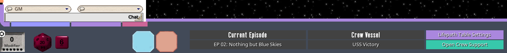
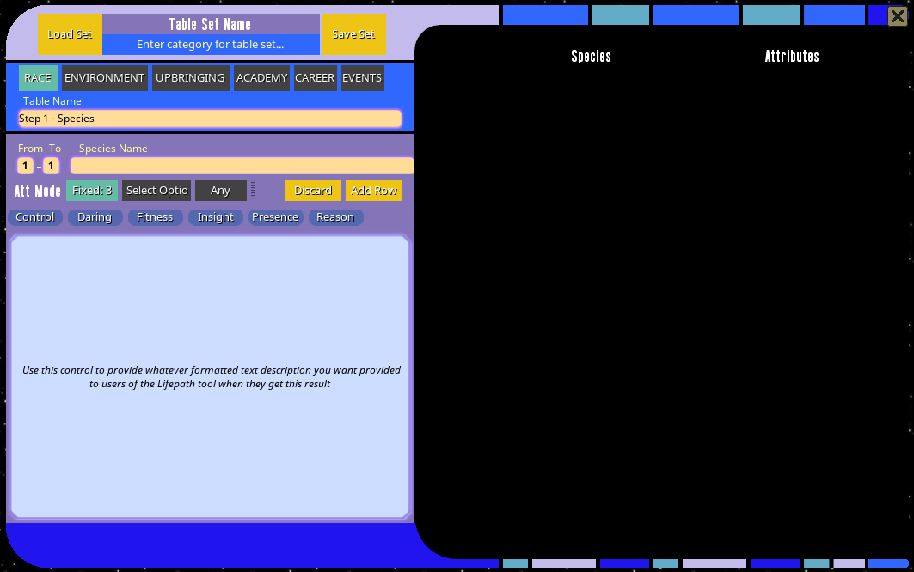
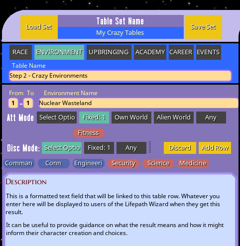
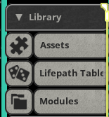

## Lifepath Table Definition

This section describes the process of manually defining tables for the Lifepath wizard. It can be done by simply going through 
the relevant section of the PDF and using the wizard I created.

You may ask why I went to the trouble to create a UI wizard to define tables in a specific format rather than simply creating 
the tables myself. It would be much less work to simply create the tables and package them in. But the written content of the tables 
is copyrighted intellectual property of Mopiphius which I am sure they worked very hard on, so packaging that content into my 
extension would be unethical (and probably illegal). So if you want to have automated tables in the tool, this wizard 
seemed like the way to go.

This ensures that users of the extension have to buy the actual source book in order to be able to use the lifepath tables 
from the book.

As a side bonus, it also means that you can define your own custom table sets if you want to use a non-standard set of tables for 
character creation in your game. 22nd century setting? Orion Syndicate? Romulan spies? All Borg all the time? Knock yourself 
out, you can create whatever custom tables you want for character creation in your games.

### Creating a tableset

The wizard outputs ordinary Fantasy Grounds table records, but it also creates a tableset reference to link the records 
together into a single set, and allow for setting the defaults to be used by players more easily.

Also, the formatting of the data in the tables must be exactly as the tool expects, so this wizard ensures that the tables 
created will work with the lifepath wizard and function as expected. 

To open the tableset wizard, simply click the "Lifepath Table Settings" button in the GM detail pane:

Then in the settings window, use the green + icon to open the wizard:

The wizard will look like this:

At the top, you set a name for the full set of tables, this is what you then set as the default for lifepath creation for 
your players to use.

Just below that you can set a separate table source for generating random species in the 
[Supporting Character creation wizard](../record_docs/ship_record#supporting-characters). 

The tabs below will take you through the six steps of lifepath creation. In the blue input section, you can enter names 
for each individual table (I would recommend giving each table within the set a globally-unique name to avoid any 
issues with FGs normal name-based table resolution mechanism). 

In the purple input section, you define each row in the table by entering the from/to range of numbers, the name of the result, 
and then using the control widgets to select whatever attributes or disciplines are linked to that result.

Attribute and Discipline results for each result can be set to Fixed, Select or Any modes. Fixed mode is where the result 
is a specific outcome and the player does not have to choose anything. Select mode allows you to specify a subset of options 
that the user can choose from. Any will simply allow the user to choose any attribute or discipline with that result.

Here is an example of defining a row in a tableset:

Clicking "Add Row" will commit the row to the table display on the right. Once you have completed your table definitions, 
the "Save Set" button will save all 6 tables and create a new tableset definition. Selecting/setting a tableset uses the 
tableset name, so make sure to set a unique name before saving the tableset.

Tables created by the tableset wizard will be saved under the category "LifePath Wizard Tables - Do Not Edit". Editing the tables 
directly outside the wizard MAY work, but it also may break the ability of the Lifepath Wizard to properly read the column 
values. 

The tablesets themselves are stored in their own "Lifepath Tables" section of the library:

It shouldn't generally be necessary to directly edit the tablesets, but it may be desirable in some cases, so that is why I 
added them as a separate record type accessible via the library. Tablesets can also be deleted manually here, although deleting 
the tableset will not delete its constituent tables (which are just regular FG tables) so if you are deleting a tableset, 
you may also want to manually delete any associated tables.

If a tableset needs to be modified after its initial creation, the "Load Set" button in the wizard can be used to load existing 
tablesets in their entirety into the tool.

Each row also has an edit button that will load the row contents into the row editor to allow editing and updating of 
previously defined tables:

### Special Cases

For the Environment step, there is an additional option to select "Own World" or "Alien World" as those are required behaviors 
in the default Lifepath tables. "Own World" will allow you to choose an attribute from the character's species' options, while 
"Alien World" will automatically roll the Species table again and allow you to choose one of that species' attributes.

In the Career step there is an option to specify a specific talent as two of the levels of career experience in the default 
tables do specify a fixed talent selection at that stage. 