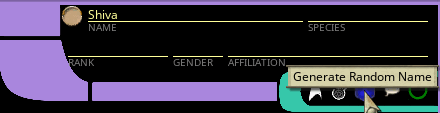
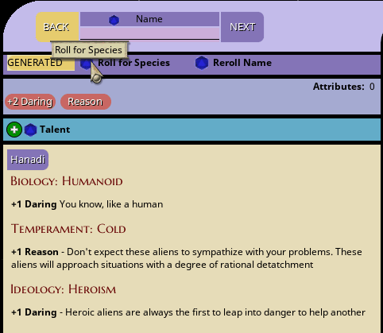
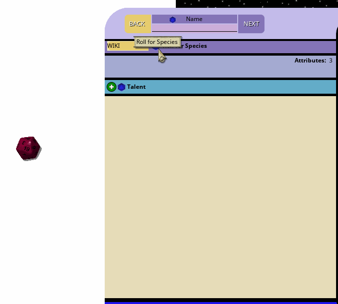

## Additional Random Tables Module

In addition to the core extension features, I packaged together a handful of useful tables that I created into a module that 
integrates to a number of the extension features. That module is available here:

[Random Alien Tables](../module/fen_random_alien_tables.mod)

As with any FG module, just place it in the modules directory and load it from inside your campaign.  The module mainly 
contains additional tables for random generation. The functions it includes are:

### Alien Name Generation

In NPC records, the Crew Support window and the Lifepath Wizard, there is a blue d20 icon near the name fields. That icon 
will generate a random alien name from the alien individual name from the alien individual name tables:

### Alien Race Generation

For use in the Lifepath Wizard, will generate completely random alien races if someone wants to play something completely unique:

### WIKI Species Table

In addition to generated alien races, I wrote a web scraper to scrape all the "Alien race" pages from Memory Alpha and 
export them into a series of tables, weighted by the number of words in their race page, and the number of references to their 
name from all the episode pages. This created a table that will generate a randomly selected race from the Star Trek universe 
along with a link to the wiki page (in case they are too obscure and you have to look them up):

The generated and Wiki species modes have to be enabled in the Lifepath settings window, accessible via the 
"Lifepath Table Settings" button on the desktop:

If they are enabled, you can set the mode dropdown to GENERATED or WIKI on the species step of Lifepath creation, or 
for supporting character creation, and use them instead of a conventional lifepath table.