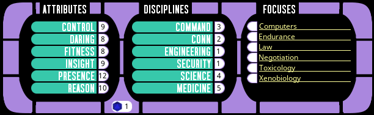
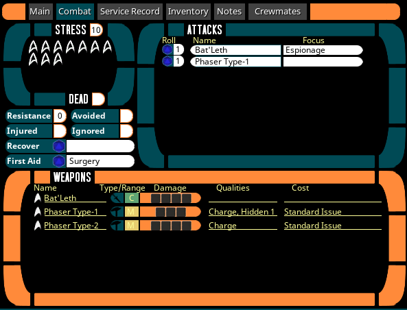
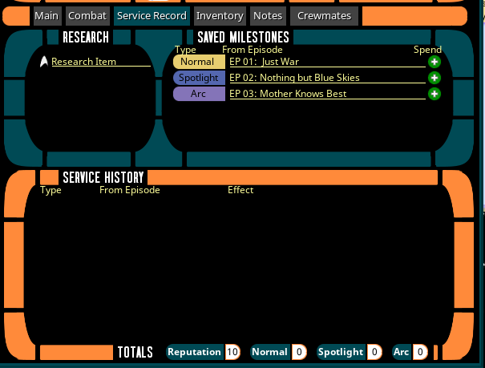
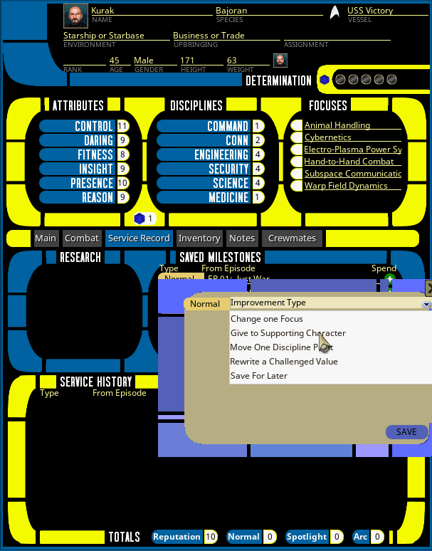
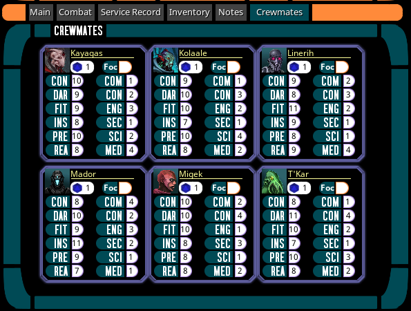

## Character Sheet Usage

This is an example of a character sheet in this extension:

Most of the basic functionality of Character Sheet controls are going to be fairly obvious to users. 
However, there are some elements of sheet functionality that warrant additional explanation.

### Applying determination 

The determination counter works like other counter controls in Fantasy Grounds, but the blue d20 icon next to the counter 
will spend a point of determination for an automatic 1 added to the next skill check.

### Making Skill Checks

To roll a test, just select the attribute and discipline by clicking the fields displaying their scores. A focus can be applied 
by ticking the box next to the focus name. The roll widget in between the Attribute and Discipline lists can be used to 
set a roll difficulty (default is 1) and then you can either double-click or click and drag the blue d20 icon to perform a standard 2d20 roll.

The roll widget defaults 2d20 but you can get a single d20 by either dragging/clicking with the middle mouse button, or 
holding CTRL while dragging/clicking on the roll widget.  

Additionally, once a score is selected, you can also just roll from the normal dice tray and the 
selected attribute, discipline and focus will be applied.

### Combat Tab

The combat tab has a number of convenience controls. The "Attacks" pane can be used to define regularly used attacks by 
selecting a weapon from the combobox. If the character has an applicable focus that would apply to those attacks, that can 
be selected in the second combobox.

Similarly, the "Recover" and "First Aid" controls will perform the appropriate skill checks to recover from an avoided injury 
or perform first aid to stabilize an injured character. They also allow a linked focus to be set.

### Service Record Tab

The Service Record tab is where players can keep track of milestones, reputation changes, and long-term research items that 
may not be linked to any specific scene/episode and may require multiple sessions of play to resolve.

When awarding Milestones they can just be added to the "Saved Milestones" pane, the type is a multistate button, so just click 
on the type control to change between normal, spotlight and arc milestones. The episode column will autopopulate with the name of 
the current episode (if one is set in the campaign). If not, it can be edited.

Players can then spend the milestones by clicking the green + icon. Doing so will bring up a popup where they can select 
how they want to apply the milestone. After using the milestone in this way, the milestone will move below to the service 
history with an indication of what it was used for. For example:

You can also add notes of Commendations or Reprimands to the Service History to note changes to character reputation per 
the reputation rules.

### Inventory and Notes Tabs

Nothing particularly unique about these two.

### Crewmates Tab

For NPCs representing other crewmates who are present in most or all stories, they can be added under the "Senior Staff" 
records rather than as regular NPCs. Once they are added here, if they are shared with players they will populate the 
crewmates tab, allowing the PCs to roll on their behalf. This way, if players are ordering/asking other senior staff NPCs 
to perform various tasks or to assist them in tasks, they can roll for those NPCs on their own.

Rolling here works the same as in other roll controls. With the exception that there is only a single control to apply a 
focus. If a crewmate has an applicable, just let the player know before rolling and they can tick the focus box (but they won't 
know what the NPCs focuses are).