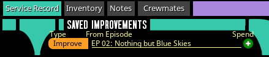
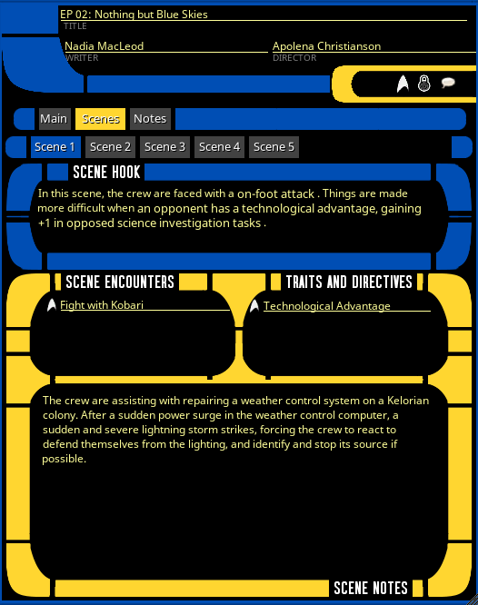

## Episode Records

Episode records are fairly straightforward in terms of the data in the records themselves, but the way that they connect to 
some of the other features is a bit less obvious, so let's get into that. First, this is what episode records look like:

Like several over record types, the colors are configurable.

### Setting the Episode

In the header of the episode record, you will see the "Activate" icon like you would typically expect to see on an NPC. 
In the case of episode records, that will set the "Current Episode" display in the GM info panel of the desktop:

But having or setting a current episode has other effects that you might not notice. The most important is how it ties into 
[Supporting Characters](../record_docs/ship_record#supporting-characters). The rules for supporting characters in the rulebook 
say that anytime a pre-existing supporting character is introduced to a subsequent adventure, that supporting character 
gets an improvement.

That is automated in the ruleset as long as the current episode is being set properly at the start of each episode. 

Whenever the active episode is changed, any active supporting characters created from the wizard will have their status 
changed from "Active" back to "Available". The crew vessel will also have its current Crew Support value reset to equal its 
max crew support.

If you then re-introduce a supporting character from the Available tab, they will automatically get an improvement in the 
Service Record tab of their character sheet.

For example, here is a supporting character that was created in Episode 1, and then re-introduced in Episode 2:

Once activated, you will see an "Improvement" in that Supporting Character's service record which can be spent just like a 
[milestone](../record_docs/charsheet_doc#service-record-tab):

The current episode name will also be used as the default value for the "From Episode" column of any milestones given to 
players via the service record.

### Scenes

In order to be flexible with how many scenes an episode contains, the "Scenes" tab contains a tab list of any number of scenes 
you need in a given episode. You add scenes with the green + icon, and delete them via the edit mode icon on the right 
(which will add a delete button to each individual scene):

