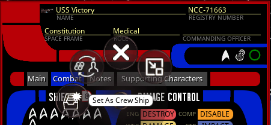
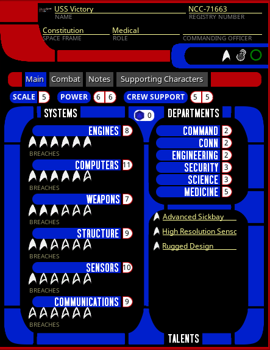
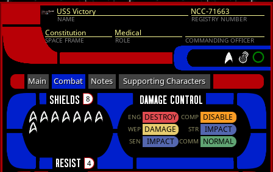
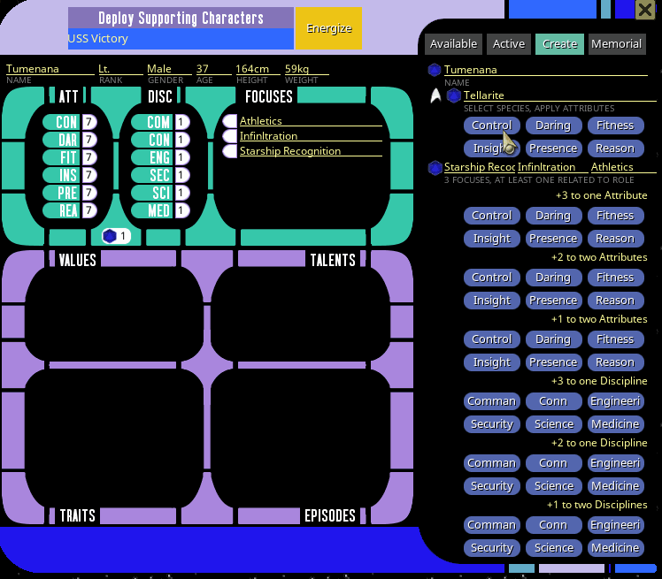
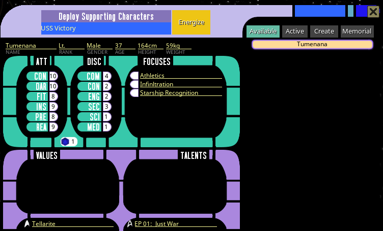
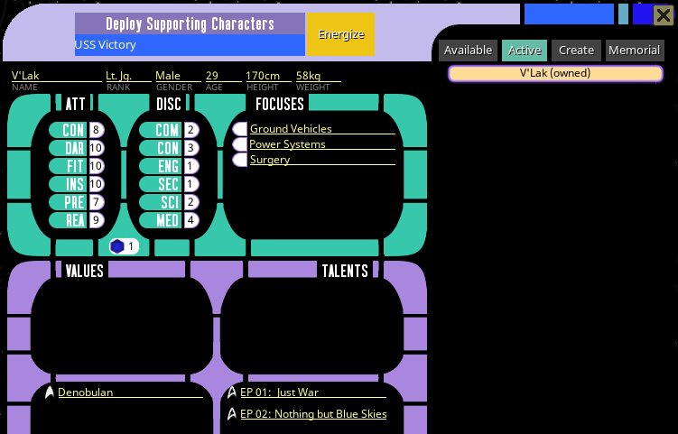

## Ship Records

Most of the ship record functionality is self-explanatory. But there are a couple of things worth noting.

### Setting Crew Vessel

In the right-click menu for ships is an option to set a ship as the crew ship:

This has 3 main effects:

 * It will automatically share the sheet to all of the players so they can view the ship's stats and roll assist rolls from the ship
 * When players create characters, they will automatically have the crew ship linked on their character sheets
 * When spending a milestone via the Character sheet service record, some of the options apply to the ship rather than the character and selecting those will apply to the selected crew ship

When a crew ship is selected, it will be displayed in the GM panel on the desktop.

### Breaches and Damage Control 

Beneath each system in the Systems list is a counter for the number of breaches on a system: 

The counter will always be 1 more than the ship scale. When systems suffer breaches, their damage status will be reflected in 
the damage control pane of the Combat tab:

### Supporting Characters

The "Supporting Characters" button can be used by players to create and deploy supporting characters as defined in the rulebook. The 
supporting characters window can be used to create or re-use supporting characters. The "Create" tab has controls required to 
define a new Supporting Character as described in the rules.

You roll or select a species (which will use the default Lifepath table configured in your Lifepath Table Settings), enter 
or generate a name, enter or generate Focuses, and then apply attributes as indicated:

After the character is defined, the "Energize" button will save that supporting character and activate it as an identity 
for that player. Even though the supporting characters are charactersheets, they are not visible via the character select 
window and instead are only visible (to players) via the supporting characters widget.

The GM can see all the supporting characters in the character select however, in case you need to access them directly.

And as the GM, the "Create" tab works differently than for players. When the GM uses the create tab to create a character, 
it will be created as an NPC and not a supporting character. So as the GM, you can use the widget to quickly create minor NPCs 
with appropriate stats when needed.

Players can also bring in previously defined supporting characters via the "Available" tab:

Creating a new Supporting Character or re-introducing a Supporting Character both cost 1 crew support. So when activating a 
character from the "Available" tab or creating one from the "Create" tab, the ship's crew support will automatically decrement 
by one.

Once a supporting character has been introduced into an episode however, it does not cost additional crew support in order 
to reuse them. So the "Active" tab of the Supporting Characters window shows which Supporting Characters have already been 
created or activated within the current episode, and players can use these supporting characters without costing additional 
crew support

The "Episodes" list in the character summary will show which episodes they were used in, and should update automatically as 
long as the "Current Episode" is set when they are created or introduced.

Additionally, when a supporting character is reintroduced in a subsequent episode, they are given an improvement, which can 
be spent in the same way as a milestone for a player character. 